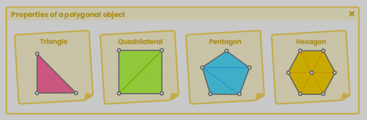
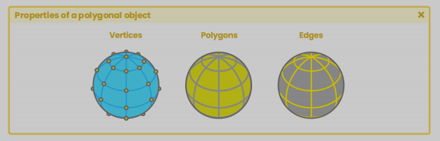

# unityShading

## 这是有关 unity shading 的知识总结，内容包括三大部分
### 1, unity 环境下的 shading 编程基础
>* shaderlab 语法
>* shaderlab 的材质属性与变量
>* subShader
>* 渲染参数配置（即 colorMask，stencil，blending，等等）
>* pass 和 CG, HLSL 的结构
>* 函数算法
>* 顶点数据结构
>* 语义 semantic
>* 图元
>* 顶点着色阶段，片元着色阶段
>* 矩阵与坐标系
>* 其他...
---
### 2, 光照，阴影，与表面
>* 法线纹理与实现
>* 反射纹理
>* 光照与阴影实现
>* 基本着色模型
>* 材质
>* 数学函数
>* 高光与环境光遮蔽
>* shader graph，结构，函数，节点，属性
---
### 3, compute Shader，ray tracing 和 sphere tracing
>* compute shader 的结构
>* buffer 变量
>* kernels
>* sphere tracing 的实现
>* 隐式表面
>* 构建形状几何与算法
>* ray tracing 介绍
>* GPGPU 编程
>* HDRP 中的光写追踪
---
## 开始

## 1, Shader 编程前导
### 几何体对象的属性

"polygon" 一词，源于希腊语，由 poly (许多) 和 gonw (角) 组合而成，所以 "polygon" 原指由多条线段围成的闭合的面.

"primitive" 是一个预先构建好的 3D 对象，例如 unity, maya, blender 会定制许多球，胶囊体，立方体，圆环，来作为基本几何体，这些都是网格对象，称为 "mesh".

mesh 由若干个 vertex 构成，每个 vertex 都包含一些属性，称为 attributes，常见的属性包括，位置，切线，法线，UV，颜色，等等. 根据运算的需要，可以为 vertex 添加更多的属性.

通过 shader，可以单独的访问每一个独立的顶点，从而得到关于这个顶点的所有属性，并且修改这些属性。

#### 顶点 (vertices)

vertices (vertex 的复数) 一词根据使用环境不同有些区别，一般情况下，顶点只对它构成的表面负责，一个表面，包含了若干顶点，但在 maya 和 blender 这样的 dcc 软件中，vertices 的指的是所有处在该位置顶点，可以看作是交点. 例如，如果你选择一个立方体某个角上的 vertex，看似只选择了一个 vertex，但其实这个 vertex 要对应三个 surface，因为三个 surface 的顶点相较于此，所以 vertex 在这里可以看作是交点.

另一方面，maya 中的每一个网格对象，都会包含两个默认的子对象，一个是 transform，用来保存当前对象的变换信息 (position, rotation, scale)，另一个是 shape，用来表示对象的网格数据，包括 shading 相关的配置，，vertices 在 maya 中，都是 transform 对象的子对象，vertices 中位置属性 (position) 默认情况下保存的是相对于该几何体 volume 中心点的位置.

#### 法线 (normals)

此属性的作用时用来决定一个面 (face) 的朝向，它是一个向量 (vector)，表示 "正面" 的方向，normal 不但可以用来表示面的方向，也能够用来表示点的朝向

#### 切线 (tangents)

这里引用 unity 的描述, 切线也是一个向量，它垂直于法线，指向几何体 uv 坐标系中 u 轴朝向的方向，与切线相关的叫做副切线 (bitangents)，它于法线，切线都垂直，在 shader 中，默认情况下是无法访问副切线的值的，但是，通过 normals 和 tangents 的叉乘 (cross) 计算，可以求得副切线

切线数据通常是引擎根据 uv 计算出来的，实践中，没有 uv 数据的网格，也不会有切线信息，因为从数学上讲，一个顶点的切线会有无数个

#### 纹理坐标 (uv coordinates)

它是 3D 几何对象之所以能于 2D 纹理之间构建映射关系的依据，它表示某个几何体的某个点应当在纹理的哪个位置取得一个像素的值，构建纹理坐标的过程，叫做 "展 uv" (uv mapping).  纹理坐标是一个 2D 数据，在 shader 中，这个属性不但可以被访问，也可以保存其他的数据作为该属性的值

#### 顶点颜色 (vertex color)

3D 软件导出的模型在顶点颜色的默认值是 "白色"，包括 RGBA 4 个通道

>* 图形渲染管线逻辑

渲染管线，render pipeline，就是一系列任务操作的集合，这个集合的终极目标就是在当前帧内绘制出一个画面，每种渲染管线逻辑（例如 unity 的 built-in, URP, HDRP），都有其自身的特点，应用场景，优势. 这些一系列的任务都是通过 shader 程序发生的

图形渲染管线与引擎渲染管线，在实际所指上有些区别，前者是底层的图形 API 例如 (dx, opengl, vulkan) 等在处理渲染事务上的方法，是明确直接的，而引擎渲染管线，则是在这个基础上进行了一层封装，其目的是为了处理场景中大量的不同对象要如何快速地被组织并渲染
补充：一个 draw call vs 一个 final image

在 unity 中，渲染被分为了应用阶段（application），几何阶段 (geometry)，光栅化阶段 (rasterization)，像素阶段 (pixel)

>* 渲染路径

渲染路径，rendering path，决定了渲染管线处理材质光照的解决方法，常见的渲染路径即 forward 和 deferred，之所以有这种区别，前者有更广的应用范围，是因为这种方案能够适配更广泛的图形硬件

unity urp 只能使用 forward，而 hdrp 则二者皆可

>* draw call

绘制命令，无论使用哪种渲染路径，都会产生一系列的 dc，这些 dc 计算的结果最终组合在一起，形成了屏幕上的最终画面, 每个 dc 都是由一个 shader 中的 pass 触发的，默认情况下，如果场景中有 4 个 cube，渲染这个 4 个 cube 就需要产生 4 个 dc
一个 shader 通常由若干个 pass 组成，根据渲染管线当前渲染画面的阶段，会触发不同的 pass，例如，在一个有光的渲染环境，与一个无光的渲染环境，触发的 dc 是不同的，因为有光的渲染环境，除了本身的着色 pass ，还包含计算阴影所需要的 pass

>* deferred shading

延迟渲染能够确保所有的光照相关的计算仅需要一次计算，整个渲染被分成了 geometry 和 lighting 两个阶段，这种情况通常用用场景中有大量的对象被大量不同的光源影响的情况下，但坏处是增加对于每个像素（pixel）的计算复杂度
延迟渲染在多光源处理上会更加高级，但会有硬件条件的兼容性问题，并不是所有图形设备都支持，尤其是在移动平台

>* shader

urp 和 hdrp 都推荐用 shader graph 来构建 shader 程序，这种方式的最大问题是在大版本升级的时候，例如 2019 -> 2020 出现兼容问题，hlsl 代码流才是最靠谱的方式

>* 矩阵计算 matrices

矩阵相乘， m x n 矩阵与 i * k 矩阵相乘时，只有 n == i 时，相乘计算才能有意义，且结果为 m * k 的矩阵

unity 中 m 矩阵来自于对象当前的 transform，这是一个 4x4 矩阵，这是因为这样可以统一旋转缩放与平移变换的矩阵乘法，

vector = x，y，z，w 其中 w 的值总是 0 或者 1，用于表示点（point）的时候等于 1，用于表示方向（direction）的的时候则为 0

变换（transform) 是矩阵最主要的作用，一个矩阵，表示了一种变换，例如

1 0 0 1
0 1 0 1
0 0 1 1
0 0 0 1

这个矩阵表示了 "平移 = 1, 1, 1" 的变换，这个概念需要动态地去理解，想象成 "把一个东西向 x，y，z 三个方向都平移 1 个单位" 的一个动作，会比较形象，在计算中，M * p (p 是一个 vector)，会得到对这个 p 进行 M 变换后的结果，即 p'， 如果计算中有 M1 * M2 * M3 * p，则表示一个复合的变换，顺序是先 M3 再 M2 最后 M1，例如常见的一种情况是，先平移变换，再旋转变换，最后缩放变换

单位矩阵则表示了 "什么都不做" 的变换

除了变换，矩阵还可以作为空间转换使用（也是一种变换），即求得不同坐标系下，坐标之间的关系，例如，在坐标系 A 的空间中，有一个坐标是 a，而坐标系 A 又处在 B 坐标系下，我们想知道在 B 坐标系下，a 的坐标应该是多少，(即需要得到 B 坐标系下，a 的变换过程) 这里面最重要的计算依据，就是 A 的变换矩阵，这个矩阵记录了 A 是怎么被移动到当前位置的，即 A 的 transform，在 unity 中这个矩阵称为 localToWorld，计算方法为

a_in_B_Space = A_in_B_space * a_in_A_Space

>* 坐标系 coordinates systems

