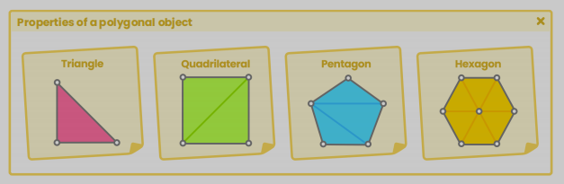
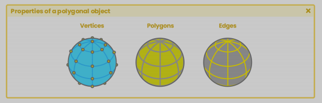

# unityShading

## 这是有关 unity shading 的知识总结，内容包括三大部分
### 1, unity 环境下的 shading 编程基础
>* shaderlab 语法
>* shaderlab 的材质属性与变量
>* subShader
>* 渲染参数配置（即 colorMask，stencil，blending，等等）
>* pass 和 CG, HLSL 的结构
>* 函数算法
>* 顶点数据结构
>* 语义 semantic
>* 图元
>* 顶点着色阶段，片元着色阶段
>* 矩阵与坐标系
>* 其他...
---
### 2, 光照，阴影，与表面
>* 法线纹理与实现
>* 反射纹理
>* 光照与阴影实现
>* 基本着色模型
>* 材质
>* 数学函数
>* 高光与环境光遮蔽
>* shader graph，结构，函数，节点，属性
---
### 3, compute Shader，ray tracing 和 sphere tracing
>* compute shader 的结构
>* buffer 变量
>* kernels
>* sphere tracing 的实现
>* 隐式表面
>* 构建形状几何与算法
>* ray tracing 介绍
>* GPGPU 编程
>* HDRP 中的光写追踪
---
## 开始

## 1, Shader 编程前导
### 几何体对象的属性

"polygon" 一词，源于希腊语，由 poly (许多) 和 gonw (角) 组合而成，所以 "polygon" 原指由多条线段围成的闭合的面.

"primitive" 是一个预先构建好的 3D 对象，例如 unity, maya, blender 会定制许多球，胶囊体，立方体，圆环，来作为基本几何体，这些都是网格对象，称为 "mesh".

mesh 由若干个 vertex 构成，每个 vertex 都包含一些属性，称为 attributes，常见的属性包括，位置，切线，法线，UV，颜色，等等. 根据运算的需要，可以为 vertex 添加更多的属性.

通过 shader，可以单独的访问每一个独立的顶点，从而得到关于这个顶点的所有属性，并且修改这些属性。

#### 顶点 (Vertices)

vertices ( vertex 的复数 ) 一词根据使用环境不同有些区别，一般情况下，顶点只对它构成的表面负责，一个表面，包含了若干顶点，但在 maya 和 blender 这样的 dcc 软件中，vertices 的指的是所有处在该位置顶点，可以看作是交点. 例如，如果你选择一个立方体某个角上的 vertex，看似只选择了一个 vertex，但其实这个 vertex 要对应三个 surface，因为三个 surface 的顶点相较于此，所以 vertex 在这里可以看作是交点.

另一方面，maya 中的每一个网格对象，都会包含两个默认的子对象，一个是 transform，用来保存当前对象的变换信息，另一个是 shape，用来表示对象的网格数据，包括 shading 相关的配置，，vertices 在 maya 中，都是 transform 对象的子对象，vertices 中位置属性默认情况下保存的是相对于该几何体 volume 中心点的位置. 

>* 图形渲染管线逻辑
>* 矩阵计算
>* 坐标系

